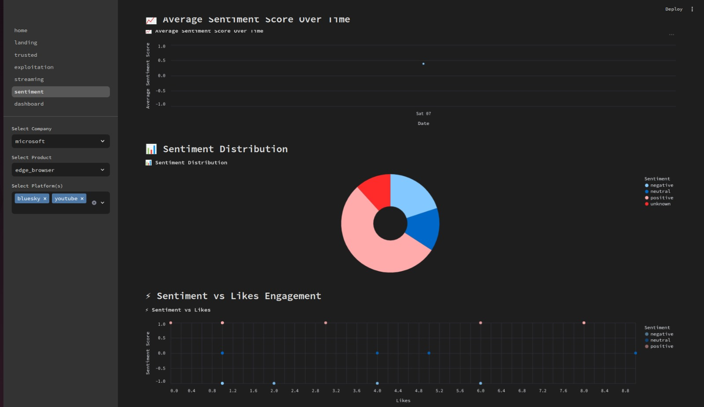
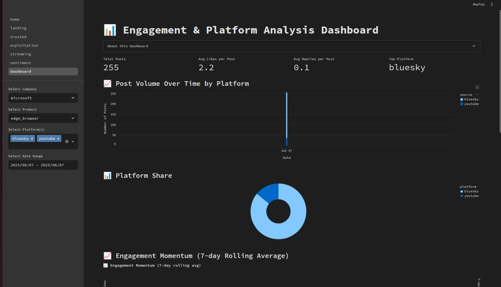
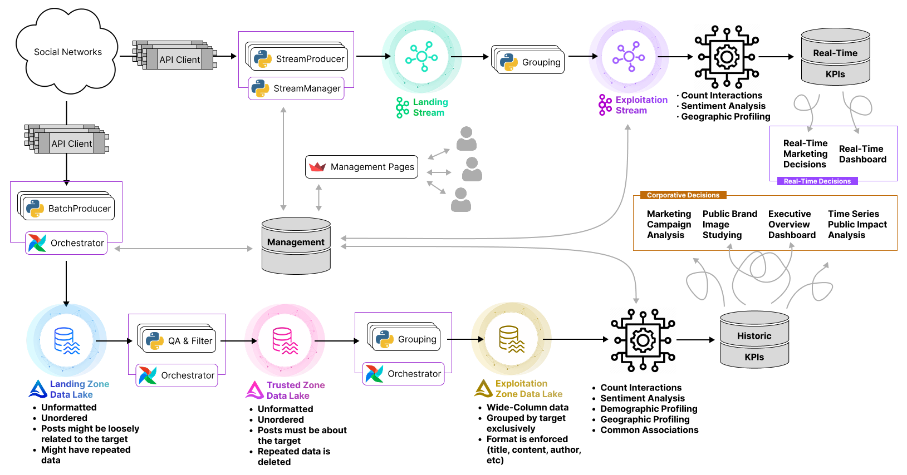

# Big Data Management


## Description 

<div align="center">
  
</div>

MDS-FIB Big Data Management (MVA) subject 2024-25 Q1. This repository contains the homework assignments and project completed during the course.

Checkout the VibeRadar data enginering end to end project inside `PROJECT/`, a quick preview:






## Contents

The system design of VibeRadar is:




```bash
📁 BDM/
├── 📁 FINALS/: Some final exams
├── 📁 LAB/: Laboratory relevant information
├── 📁 THEORY/: Theory slides, papers and exercises
├── 📁 PROJECT/: VibeRadar real-time sentiment tracking across social media platforms, huge data engineering EtE project.
├── 📄 README.md
```
## License

This project is licensed under the GPLv3 License. See the [LICENSE](./LICENSE) file for details.
